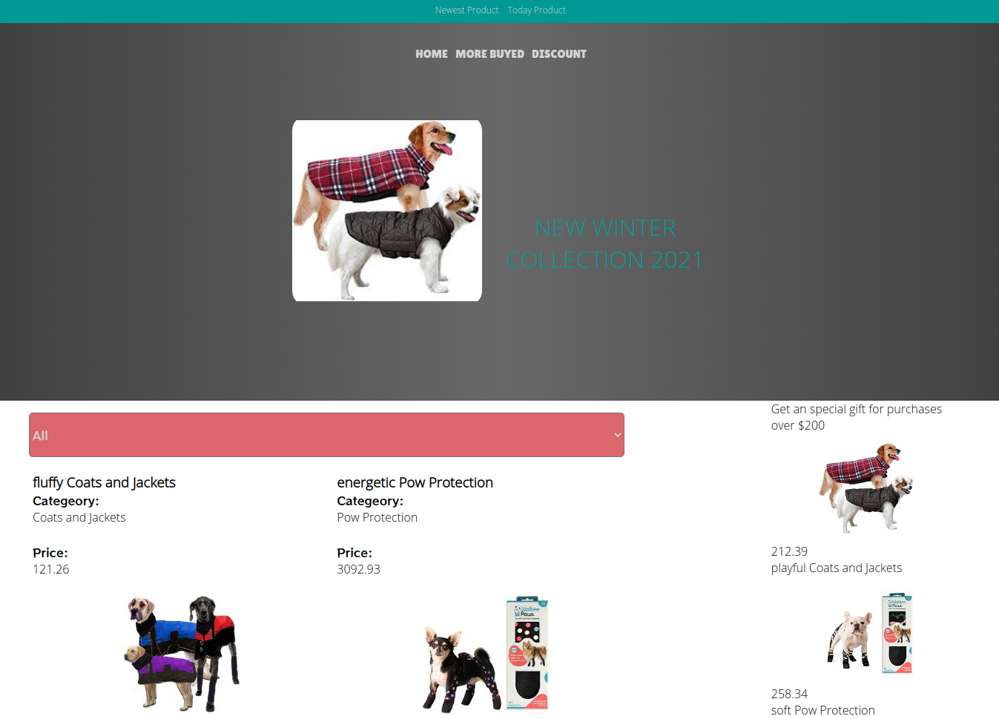

# Dog Catalog App

This app is a catalog of clothes for dogs. The web app has two types of pages, one page with a list of items that could be filtered by categories and one page for the item details. The app also collects information data from the [API Financial Modeling Grep](https://financialmodelingprep.com/developer/docs/) to display different prices to the items.

## Live Preview

[See the Book Store Online App](https://dog-clothes-catalog.netlify.app/)



## Built With

- React
- Redux
- Javascript
- CSS
- Node
- npm

## Getting start

To start with the project:

1. Install npm in your machine.
2. Clone [this repository](https://github.com/javierbotero/dog-clothes-catalogue.git)
3. cd inside the project

4. Run in the terminal
```
  npm i
```
in the terminal to install the dependencies.
5. Go to [API Financial Modeling Grep](https://financialmodelingprep.com/developer/docs/) open an account to get an API key.
6. Make an environmental variable locally named: REACT_APP_TOKEN_FMP=your_tokem_number.
7. Run in the terminal
```
  npm test
```
For running all tests.

8. Run in the terminal
```
  npm start
```
And you will have the dog catalog working locally.

## Credits

Inspiration in the design of Design idea of Denys Chagaida on [Behance](https://www.behance.net/gallery/24531031/Pimp-my-DOG-Online-store-E-commerse-project)

## Video Explanation

In this [video](https://www.loom.com/share/a58659fa558747fd88a5d301c7ab576c) I explain the basic structure, data flow, and virtual DOM tools this React & Redux app uses.

## Author

👤 **Javier Botero**

- Github: [@Javierbotero](https://github.com/javierbotero)
- Twitter: [@Javierbotero1](https://twitter.com/Javierboterodev)
- Linkedin: [Javierbotero](https://www.linkedin.com/in/javierboterodev/)


## 🤝 Contributing

Contributions, issues, and feature requests are welcome!

## Show your support

Give a ⭐️ if you like this project!
